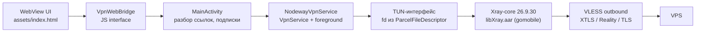

# Nodeway VPN

Android-клиент для VLESS- и olcrtc-подключений. Интерфейс целиком на HTML/CSS/JS внутри WebView, трафик заворачивает встроенный Xray-core, который владеет TUN-интерфейсом.

## Возможности

- Подключение, переключение профиля на лету и отключение из foreground-сервиса с уведомлением.
- Импорт ссылок `vless://` и `olcrtc://` из буфера обмена и из списка ссылок.
- Ссылка импорта подписки `nodeway://import#…` — из QR-кода, страницы или мессенджера.
- Проверка откликов: поочерёдный замер каждого профиля через живой туннель.
- Подписки: URL со списком ссылок, автообновление по расписанию, удаление с подтверждением.
- Профили из подписок и локальные, сгруппированные по подписке.
- Раздельное туннелирование: все приложения через туннель, только выбранные или выбранные в обход.
- Журнал событий подключения.
- Демо-режим без сервера и без ядра.

## Устройство



- `MainActivity` разбирает ссылку, держит список профилей и командует сервисом.
- `NodewayVpnService` поднимает TUN и передаёт дескриптор ядру через `env.xray.tun.fd`.
- Xray-core принимает трафик из TUN, применяет routing и отправляет в VLESS.
- Для `olcrtc://` апстрим другой: `OlcrtcProcess` держит отдельный процесс с SOCKS5, а Xray работает как SOCKS-клиент.
- `Journal` собирает события приложения и вывод обоих ядер в один список и отдаёт его странице.
- UI не знает про ядро: всё общение с сервисом идёт через `VpnWebBridge`.

Раздельное туннелирование делает не ядро, а `VpnService`: `SplitTunnel` вызывает `addAllowedApplication` или `addDisallowedApplication` при создании TUN. Изменение настроек на ходу пересоздаёт туннель, поэтому применяется один раз на кнопку «Готово».

## Журнал

Журнал на главном экране показывает события приложения и вывод обоих ядер — olcrtc и Xray. Записи лежат в `Journal`, общий буфер на 400 строк, и переживают перезагрузку WebView: страница при загрузке получает снимок, дальше — инкременты пачками по 150 мс.

> [!IMPORTANT]
> Логи Xray-core попадают в журнал через файл `cache/xray.log`: путь передаётся ядру в секции `log.error`. Приёмника логов у AAR нет — gomobile сам пишет вывод Go только в logcat, а читать logcat из приложения нельзя, это привилегия системы. `XrayLogTailer` дочитывает файл, пока идёт подключение.

Уровень строки определяется по её началу: ядра пишут его по-разному (`[Warning] …` у Xray, `ERROR: …` у olcrtc). Переключатель «всё / проблемы» оставляет только предупреждения и ошибки — на уровне `info` ядро пишет по строке на каждое соединение.

Расход батареи на журнал пренебрежимо мал: на замере ~7 строк в секунду добавляется единицы процентов CPU одного ядра. Файл логов при этом не заменяет запись в logcat — ядро пишет в оба канала, и JNI-вызов в `android.util.Log` на каждую строку остаётся отдельной статьёй расхода.

Расход ограничен по построению: буфер журнала — 400 записей, список в DOM — 200 строк, файл ядра удаляется при каждом старте подключения и не дочитывается после 8 МБ. Свёрнутый журнал не трогает DOM вовсе, развёрнутый дописывает только новые строки.

## Выключатель журнала

В настройках → «Диагностика» есть переключатель «Логи», по умолчанию выключен. Выключенный журнал — не пустой список, а полное молчание:

- ядру уходит `loglevel: none` и путь к файлу не передаётся, поэтому файл не создаётся;
- вывод olcrtc читается всегда — иначе клиент встанет на заполненном буфере канала, — но в журнал не идёт;
- `Journal.append` отбрасывает всё, включая сообщения приложения;
- карточка «Журнал» скрывается на главном экране.

В logcat при этом пишется всегда: он кольцевой, бесплатный и нужен для отладки.

> [!NOTE]
> Файл логов ядро открывает только на старте, поэтому включённый на ходу журнал наберёт полноту после следующего подключения. Об этом приложение пишет строкой в сам журнал.

## Проверка откликов

Кнопка с «волной» в шапке группы пускает очередь: туннель поочерёдно поднимается на каждом профиле группы, и для каждого меряется время до первого ответа. Замер идёт **через туннель**, а не до сервера: обычным сокетом здесь ничего не сказать — профиль может отвечать напрямую и при этом не работать через VPN.

- Проверка идёт в отдельном состоянии `PINGING`: кнопка питания гаснет и не нажимается, а в плашке статуса видно «Проверка: 2 из 5» и имя текущего профиля. Туннель при этом то поднимается, то гаснет, и показывать мельтешение «Подключено / Отключено» было бы враньём.
- Для `vless://` запрос уходит прямо в TUN, для `olcrtc://` — через локальный SOCKS5 клиента: наш пакет намеренно вне туннеля, иначе процесс olcrtc не смог бы его поднять.
- Меряется TTFB до `http://www.google.com/generate_204`. Именно `www` и именно `http`: без `www` сервер отвечает редиректом и лишний круг ушёл бы в измерение вместо туннеля, а TLS-рукопожатие стоило бы дороже самого замера — внутри туннеля трафик и так шифрован.
- Результаты живут только в памяти процесса и намеренно не сохраняются: на устройстве не должно оставаться записи «к каким адресам и когда стучались».
- Время подключения на время проверки обнуляется: туннель живёт понемногу на каждом профиле, и счётчик скакал бы в обе стороны.

Состояние туннеля целиком лежит в `VpnSnapshot`: сервис переживает смахивание приложения из недавних, поэтому Activity читает снимок напрямую и показывает живое подключение, а не «Отключено».

## Сборка

Требуется JDK 17.

```sh
./gradlew assembleDebug
```

Параметры модуля: `minSdk 24`, `targetSdk 37`, `compileSdk 37`, Kotlin JVM target 17.

Тесты закрывают чистые части — разбор ссылки, сборку конфига и выбор пакетов для раздельного туннелирования:

```sh
./gradlew test
```

> [!NOTE]
> Тестам нужен настоящий `org.json`: в обычных JVM-тестах `JSONObject.put` из `android.jar` возвращает `null`, и любой код, строящий конфиг, на этом падает. Поэтому в `testImplementation` добавлена библиотека `org.json:json`.

## Ядро Xray

Готовый AAR лежит в `app/libs/libXray.aar`. Пересобрать ядро можно gomobile bind:

```sh
gomobile bind -target android -androidapi 21 \
  -ldflags="-checklinkname=0 -extldflags=-Wl,-z,max-page-size=16384"
```

Флаг `-z max-page-size=16384` обязателен: приложение работает под `targetSdk 37`, страницы памяти на новых устройствах 16 KB.

В Gradle ядро подключено файлом, а не через maven-зависимость, чтобы версию ядра тянуть независимо от мейнтейнеров форка.

## Ссылки olcrtc

Кроме `vless://` приложение понимает ссылки `olcrtc://`. Формат:

```text
olcrtc://<провайдер>?<транспорт><параметры>@<комната>#<ключ>$<комментарий>
```

Например:

```text
olcrtc://jitsi?datachannel@https://meet.example.com/abc123#9f86d081884c7d65…$Обход списков
```

| Часть | Что это |
|-------|---------|
| `jitsi` | провайдер: `jitsi`, `telemost`, `wbstream` или `none` |
| `datachannel` | транспорт: `datachannel`, `vp8channel`, `seichannel`, `videochannel` |
| `<vp8-fps=60&vp8-batch=64>` | параметры транспорта через `&`; часть можно опустить целиком |
| `https://meet.example.com/abc123` | ID комнаты — то, что стоит в адресе самой встречи |
| `#9f86d081…` | ключ шифрования: ровно 64 hex-символа |
| `$Обход списков` | комментарий, становится названием профиля |

Ссылки берутся из буфера обмена, из списка ссылок или из подписки — тем же импортом, что и `vless://`, разбирает их `OlcrtcProfile`. Комментарий можно не писать: тогда название возьмётся из поля `##name:` подписки, а если и его нет — из ID комнаты.

> [!IMPORTANT]
> Ключ должен быть ровно из 64 hex-символов. Без него медиапоток не расшифровать, и подключение зависнет на «Подключение...», поэтому такая ссылка отбрасывается на импорте сразу.

Провайдер и транспорт из ссылки не выбираются пользователем: приложение собирает из них YAML-конфиг клиента в режиме `mode: cnc` и запускает отдельный процесс, о котором ниже.

## Ссылка импорта

Приложение открывает `nodeway://import#<адрес подписки>`:

```text
nodeway://import#https://sub.example.com/list?token=abc
nodeway://import#aHR0cHM6Ly9zdWIuZXhhbXBsZS5jb20vbGlzdA
```

Адрес передаётся как есть или в base64url, и различить их можно без флага в ссылке: в алфавите base64url нет ни «:», ни «/», а в ссылке всегда есть `://`. Разбор тот же, что у подписок из буфера, — `LinkListParser.unwrapBase64`.

Всё после `#` — фрагмент, поэтому `?` и `#` внутри самой ссылки остаются целыми: подписочный URL с токеном в query переживает ссылку без единого percent-энкодинга.

Добавление молчаливое, диалога нет. Подписка ничего не подключает и не меняет маршрут, а её адрес виден в списке подписок, так что цена ошибки — одна лишняя строка, удаляемая одним тапом. Всё, что сделано по ссылке, пишется в журнал.

Чего ссылка не умеет:

- одиночные `vless://` и `olcrtc://` из веба не импортируются: они добавили бы в список строку, неотличимую от настоящей, пока не проверишь отклик. Импортировать их можно из буфера — там кнопку нажал пользователь;
- подключение по ссылке невозможно в принципе: туннель поднимает только кнопка питания;
- адрес длиннее 4096 символов игнорируется: Intent ходит через Binder, и такой фрагмент уронил бы того, кто ссылку открыл.

Проверяется без сборки APK:

```sh
adb shell am start -a android.intent.action.VIEW -d "nodeway://import#https://example.com/list"
```

## Клиент olcrtc

Исходники лежат в `olcrtc/` и не патчатся: собирается штатный CLI, который принимает YAML как единственный аргумент. Бинарник кладётся в `app/src/main/jniLibs/<abi>/libolcrtc.so` и в git не попадает.

```sh
powershell -ExecutionPolicy Bypass -File tools/build-olcrtc.ps1
```

Требования: Go и NDK из Android Studio. Сборка всех четырёх ABI занимает около получаса, для локальной проверки хватит `-Abis arm64-v8a,x86_64`.

> [!IMPORTANT]
> Файл обязан называться `libolcrtc.so`. В `nativeLibraryDir` попадают только имена `lib*.so`, и это единственное место, откуда Android ещё разрешает `exec`: у него метка `apk_data_file` в SELinux, а из домашнего каталога приложения exec заблокирован начиная с Android 10.

> [!NOTE]
> Флаг `-checklinkname=0` обязателен: без него линковщик падает на `anet: invalid reference to net.zoneCache`. Тот же флаг нужен для libXray.

Сам процесс запускает `OlcrtcProcess`: он пишет YAML в кеш, поднимает бинарник и ждёт живого SOCKS5-рукопожатия на `127.0.0.1:10808`. Проверка идёт настоящим SOCKS5-приветствием, а не голым `connect()`, чтобы сервер не получал оборванных на середине соединений.

Отдельный процесс нужен по двум причинам:

- `olcrtc` не влезает в AAR через gomobile — там cgo и Pion/Pion-TURN с Rust-частями;
- в одном процессе нельзя держать два Go-рантайма, а `libXray` уже занимает `TLS_SLOT_APP`.

Раз его процесс не может вызвать `VpnService.protect()`, пакет приложения исключается из туннеля через `addDisallowedApplication`. Побочный эффект: трафик самого приложения тоже идёт напрямую.

## Демо-режим

Добавьте к адресу загрузки `?demo=1`:

```sh
./gradlew assembleDebug
# в MainActivity: file:///android_asset/index.html?demo=1
```

Включается мок из `assets/dev-mock.js`: подписки, профили, состояние подключения и журнал без сети. Мок не подменяет живое состояние, если в странице есть нативный мост `NodewayVpn`, так что на реальном устройстве демо-панель не появляется.

Журнал в моке наполнен заранее и дописывается при подключении, кнопка «логи» в демо-панели переключает тот же выключатель, что и в настройках, — вместе с карточкой журнала.

Проверка откликов в моке разыгрывается целиком: кнопка «проверка» в панели и кнопки в шапках групп пускают очередь по всем профилям, плашки наполняются по мере замеров, а по завершении состояние возвращается к тому, каким было до проверки. События повторяют сервис один в один — включая лишние `onProfilesChanged` на старте и на финише, — иначе в браузере не повторились бы его собственные огрехи. Отклик выводится из id профиля, а не из случайного числа: один и тот же профиль должен давать один и тот же результат от прогона к прогону.

## Ограничения

- UDP и QUIC идут напрямую мимо туннеля, VLESS их не перевозит. Для olcrtc так же: SOCKS5 UDP не перевозит, и завернуть его в туннель значит убить резолвер.
- DNS отправляется напрямую на `1.1.1.1` и `8.8.8.8`. Для olcrtc так нельзя: его DNS уходит в туннель и принудительно идёт по TCP, потому что через SOCKS UDP не работает.
- Поддерживаются транспорты `tcp` (он же `raw` в новых ссылках), `ws`, `httpupgrade`, `xhttp`, `grpc`, `http`. `kcp` и `quic` не поддерживаются.
- `olcrtc` собран только под `arm64-v8a` и `x86_64`. На 32-битном устройстве профиль olcrtc не поднимется — ядро Xray там есть, а olcrtc нет.
- Подключение olcrtc требует исходящего UDP для STUN и DTLS. За сетями, которые режут UDP (часть корпоративных сетей и мобильных операторов), ICE не сойдётся даже при успешном входе в комнату.

## Структура

| Файл | Назначение |
|------|------------|
| `MainActivity.kt` | WebView, жизненный цикл, разбор ссылок, deeplink, оркестрация сервиса |
| `NodewayVpnService.kt` | `VpnService`, foreground-уведомление, TUN, передача fd в ядро, очередь проверки |
| `VpnState.kt` | состояния туннеля, снимок подключения, прогресс проверки |
| `XrayCore.kt` | фасад над `libXray.LibXray` |
| `XrayConfigBuilder.kt` | сборка конфига Xray: TUN inbound, VLESS outbound, routing, dns |
| `TunnelProbe.kt` | замер отклика через живой туннель |
| `SplitTunnel.kt` | режимы раздельного туннелирования и их применение к `VpnService.Builder` |
| `VlessProfile.kt` | разбор `vless://` в модель профиля |
| `OlcrtcProfile.kt` | разбор `olcrtc://` и YAML-конфиг клиента `mode: cnc` |
| `OlcrtcProcess.kt` | запуск клиента olcrtc и его локальный SOCKS5 |
| `ProfileStore.kt` | хранение подписок и профилей |
| `ProfileModels.kt` | модели для UI и JSON |
| `SubscriptionLoader.kt` | загрузка и автообновление подписок |
| `LinkListParser.kt` | разбор списка ссылок из буфера |
| `Journal.kt` | буфер журнала приложения и обоих ядер |
| `XrayLogTailer.kt` | чтение файла логов Xray-core |
| `VpnWebBridge.kt` | JS interface для страницы |
| `AppIcons.kt` | иконки приложений: перехват запросов вместо моста |
| `assets/index.html` | весь UI: разметка, стили, логика |
| `assets/theme-m3.html`, `assets/theme-ios.html` | резервные темы той же страницы, синхронизированы с `index.html` |
| `assets/dev-mock.js` | мок данных для демо-режима |