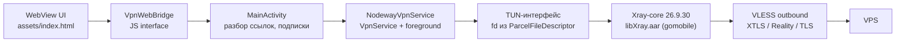

# Nodeway VPN

Android-клиент для VLESS-подключений. Интерфейс целиком на HTML/CSS/JS внутри WebView, трафик заворачивает встроенный Xray-core, который владеет TUN-интерфейсом.

## Возможности

- Подключение, переключение профиля на лету и отключение из foreground-сервиса с уведомлением.
- Импорт ссылок `vless://` из буфера обмена и из списка ссылок.
- Подписки: URL со списком ссылок, автообновление по расписанию, удаление с подтверждением.
- Профили из подписок и локальные, сгруппированные по подписке.
- Раздельное туннелирование: все приложения через туннель, только выбранные или выбранные в обход.
- Журнал событий подключения.
- Демо-режим без сервера и без ядра.

## Устройство



- `MainActivity` разбирает ссылку, держит список профилей и командует сервисом.
- `NodewayVpnService` поднимает TUN и передаёт дескриптор ядру через `env.xray.tun.fd`.
- Xray-core принимает трафик из TUN, применяет routing и отправляет в VLESS.
- UI не знает про ядро: всё общение с сервисом идёт через `VpnWebBridge`.

Раздельное туннелирование делает не ядро, а `VpnService`: `SplitTunnel` вызывает `addAllowedApplication` или `addDisallowedApplication` при создании TUN. Изменение настроек на ходу пересоздаёт туннель, поэтому применяется один раз на кнопку «Готово».

## Сборка

Требуется JDK 17.

```sh
./gradlew assembleDebug
```

Параметры модуля: `minSdk 24`, `targetSdk 37`, `compileSdk 37`, Kotlin JVM target 17.

## Ядро Xray

Готовый AAR лежит в `app/libs/libXray.aar`. Пересобрать ядро можно gomobile bind:

```sh
gomobile bind -target android -androidapi 21 \
  -ldflags="-checklinkname=0 -extldflags=-Wl,-z,max-page-size=16384"
```

Флаг `-z max-page-size=16384` обязателен: приложение работает под `targetSdk 37`, страницы памяти на новых устройствах 16 KB.

В Gradle ядро подключено файлом, а не через maven-зависимость, чтобы версию ядра тянуть независимо от мейнтейнеров форка.

## Демо-режим

Добавьте к адресу загрузки `?demo=1`:

```sh
./gradlew assembleDebug
# в MainActivity: file:///android_asset/index.html?demo=1
```

Включается мок из `assets/dev-mock.js`: подписки, профили и состояние подключения без сети. Мок не подменяет живое состояние, если в странице есть нативный мост `NodewayVpn`, так что на реальном устройстве демо-панель не появляется.

## Ограничения

- UDP и QUIC идут напрямую мимо туннеля, VLESS их не перевозит.
- DNS отправляется напрямую на `1.1.1.1` и `8.8.8.8`.
- Поддерживаются транспорты `tcp`, `ws`, `httpupgrade`, `xhttp`, `grpc`, `http`. `kcp` и `quic` не поддерживаются.

## Структура

| Файл | Назначение |
|------|------------|
| `MainActivity.kt` | WebView, жизненный цикл, разбор ссылок, оркестрация сервиса |
| `NodewayVpnService.kt` | `VpnService`, foreground-уведомление, TUN, передача fd в ядро |
| `XrayCore.kt` | фасад над `libXray.LibXray` |
| `XrayConfigBuilder.kt` | сборка конфига Xray: TUN inbound, VLESS outbound, routing, dns |
| `SplitTunnel.kt` | режимы раздельного туннелирования и их применение к `VpnService.Builder` |
| `VlessProfile.kt` | разбор `vless://` в модель профиля |
| `ProfileStore.kt` | хранение подписок и профилей |
| `ProfileModels.kt` | модели для UI и JSON |
| `SubscriptionLoader.kt` | загрузка и автообновление подписок |
| `LinkListParser.kt` | разбор списка ссылок из буфера |
| `VpnWebBridge.kt` | JS interface для страницы |
| `assets/index.html` | весь UI: разметка, стили, логика |
| `assets/dev-mock.js` | мок данных для демо-режима |